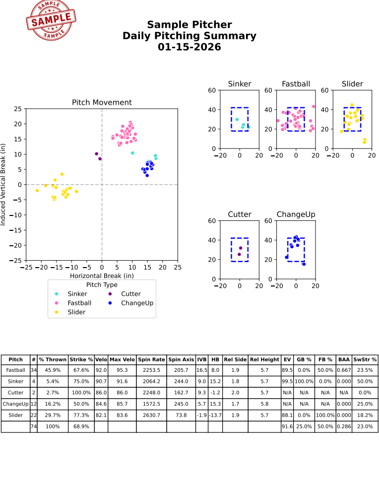

# Pitcher Report Generator

A Python tool for generating pitcher reports from TrackMan data. The report summarizes pitch movement, location, velocity, and performance metrics for evaluation.

## Example Report



[View sample report as PDF](reports/sample-report.pdf)

The example above was generated using fully synthetic data designed to resemble the structure and realistic values of a TrackMan export. No real player or team data is included.

## Features

- Pitch movement visualization by pitch type
- Pitch location plots by pitch type
- Pitch usage and strike percentages
- Velocity, spin, movement, and release metrics
- Batted-ball and opponent performance metrics
- Custom team logo support
- PDF report generation

## Usage

Clone the repository:

```bash
git clone https://github.com/jdgott24/pitcher-report-generator.git
cd pitcher-report-generator
```

Install dependencies:

```bash
pip install -r requirements.txt
```

Generate a report from a TrackMan CSV:

```bash
python daily-report.py example/sample_trackman.csv --team TEAM_A --logo resources/sample_logo.png
```

## Technologies

- Python
- pandas
- NumPy
- Matplotlib

## Data

The included sample dataset is synthetic and is provided only to demonstrate the functionality of the report generator. It follows the structure of TrackMan pitch-level data while containing no real player or team information.
